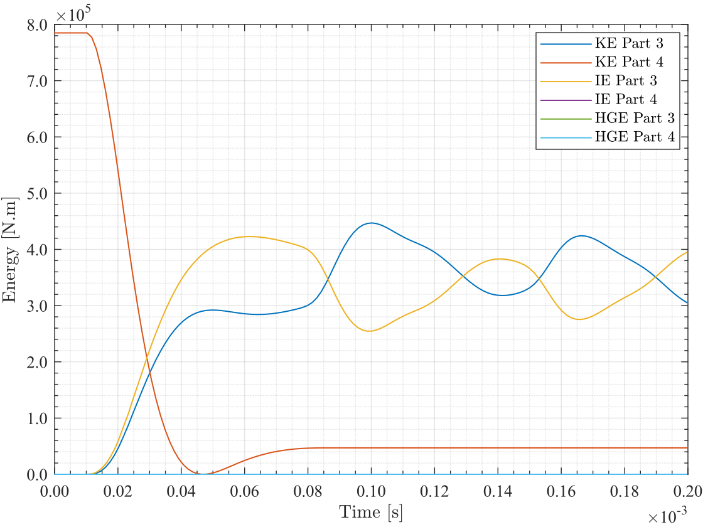

# Example LS-DYNA files
## Introduction
Given are three LS-DYNA files. `plane_strain_impact.k` is the model's input keyword file. The remaining two are binary results files.
`binout` contains the actual output data of interest, and `d3plot` is the root d3plot file from which we'll retreive the input mesh data.

In the input model, the following result databases are requested: "matsum" and "glstat" (to get global energy data), "nodout" 
(to get nodal results), and "elout" (to get element results), and lastly "ncforc" (to get contact force results). We set `BINARY=2` in `*database_matsum`, etc, so that results 
are written to a `binout` file after the model was run. 

## Description of the model
A simple input model was chosen for brevity. It consists of a small rigid impactor that is moving downward with an initial velocity and hitting
a larger deformable solid (from above), which was initially at rest. The model includes a typical (frictionless) contact definition to account for the impact event. 
During the impact, the initial kinetic energy of the moving impactor diminshes as partial momentum is transferred to the larger deformable body. The 
larger body absorbs part of that input energy as internal (strain) energy. The remaining energy is converted into kinetic energies that are split between
the two bodies (the impactor and the deformable solid). The impactor reverses the direction of its motion, and the impact event ends when the two bodies
ultimately lose contact. The impactor departs away (with no return) with a new terminal velocity, and endless elastic waves' propagations get established
in the deformable solid.   

Both the impactor and the deformable body are assumed to be solids in a state of "plane-strain". Therefore, they are modelled as 2D "shell"s in the xy-plane as
a simplification. The y-axis is the vertical. The impactor is of size 0.2 x 0.2 m, while the deformable solid is 1.0 x 0.4 m.


## content of the `binout`
After the above example model was solved in LS-DYNA, a `binout` was generated that contains the following databases:
+ `matsum`
+ `glstat` 
+ `nodout`
+ `elout`
+ `rcforc`

Also several d3plot files were generated by LS-DYNA. However, we have provided the root (or first) d3plot file as this is very samll in size, and it is the one
that we need to retreive the initial mesh (i.e. the control data of the input model).  

The results and control data in the `binout` and root `d3plot` files were then read in MATLAB by using the `get_binout_data()` reader function:
```
binin = get_binout_data('../LS-DYNA-sample/binout');
```

In MATLAB, if you run `fieldnames(binin)`, you'll get a cell array of the names of the available fields of the `binin` structure. This array should be 
`{'matsum','glstat','nodout','elout','rcforc','control'}'`. Using Matlab dot-indexing (i.e. using "."), this statement: `binin.matsum` gives you all data contained 
in the matsum database. The data are organised into two main structures: the "metadata" and the "data". The actual data are in the "data" structure. Again, 
if you use: `fieldnames('binin.matsum.data')`, Matlab returns the names of the fields of the "data" structure, e.g. 
the `time`, `kinetic_energy`, `internal_energy`, `hourglass_energy`, etc. Recall that "matsum" gives global and energy data for the parts in the model. The IDs of the parts are stored in a field called "ids" that is found in the "metadata" structure, i.e. in `binin.matsum.metadata.ids`.

In particular, you can use:
```
ids = binin.matsum.metadata.ids; % vector of IDs of parts. 
t = binin.matsum.data.time; % the time vector for matsum database
ke = binin.matsum.data.kinetic_energy; % 2D array of kinetic energy (rows-> time states, cols-> correspond to part ids)
```

to access the ids of parts, their kinetic energies, and the time vector. The 2<sup>nd</sup> column of `ke` is the time history of kinetic energy for the part
whose id is stored in the 2<sup>nd</sup> entry of the `ids` vector. That is, the number of columns of `ke` equals the number of entries of `ids`, and also the number of rows of `ke` equals the number of entries of the time vector, `t`. 


The above example for the matsum applies equally to the databases: `glstat` and `nodout`. The `elout` database differs only by the presence of intermediate
structure to specify the type of element, which is located immediately under the "elout". Since our example contains only "shell" elements, then the statement:
`fieldnames('binin.elout')` will then return `{'shell'}`. The structure (`binin.elout.shell`) is the one that contains the "data" and "metadata" structures. Stresses, 
strains, and other element quantities are stored in the "data" structure. Unlike other databases, IDs of the elements are stored in the "data" structure itself, e.g. in 
"binin.elout.shell.data.ids". For shells, the number of integration points is stored in a field called "nip" under the "data" structure.


The Matlab script `test1.m` (found in the [src](../src/) folder) contains useful examples to access and work with the various data from most of the databases included in the 
example. The script also provide the MATLAB code to generate result plots, model geometry, and some animations. Sample output files generated by the provided 
Matlab script can be found in the [figs](../figs/) and [videos](../videos/) folders.

### kinetic energy graph
 

### model animation


  