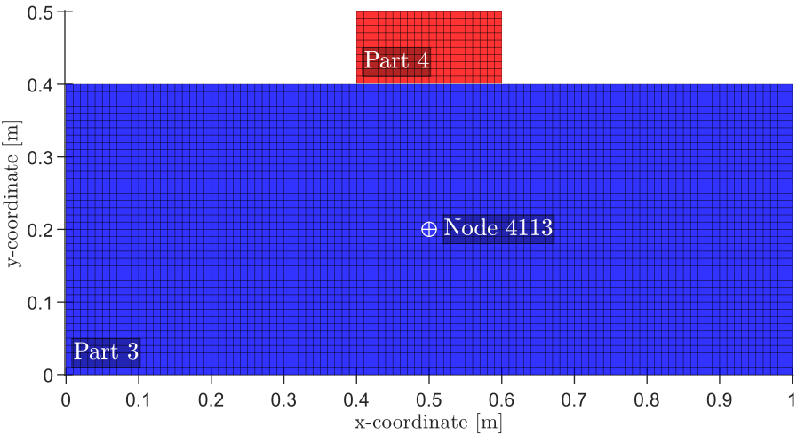

# Example `LS-DYNA` Files
## Introduction
Given are three `LS-DYNA` files. `plane_strain_impact.k` is the model's input keyword file. The remaining two are binary results files.
`binout` contains the actual output data of interest, and `d3plot` is the root d3plot file from which we'll retrieve the input mesh data.

In the input model, the following result databases are requested: "matsum" and "glstat" (to get global energy data), "nodout" 
(to get nodal results), "elout" (to get element results), and lastly "ncforc" (to get contact force results). We set `BINARY=2` in `*database_matsum`, etc, so that results 
are written to a `binout` file after the model was run. 

## Description of the Input Model
A simple input model was chosen for brevity. It consists of a small rigid impactor (Part 4 in the figure) that is moving downward with a high initial velocity and hitting
a larger deformable solid (Part 3 in the figure) from above, which was initially at rest. The layout of the bodies just before impact is shown below:

<p align="center">

<b>Fig 1:&emsp;</b>Input Model's Geometry. </p>
<!-- <figure width="30%" style="margin:0 auto; width:300px">

<figcaption><b>Fig 1:&emsp;</b> Input Model's Geometry.</figcaption>
</figure> -->


The model includes a typical (frictionless) contact definition to account for the impact event. 
During the impact, the initial kinetic energy of the moving impactor diminishes as partial momentum is transferred to the larger deformable body. The 
larger body absorbs part of that input energy as internal (strain) energy. The remaining energy is converted into kinetic energies that are split between
the two bodies (the impactor and the deformable solid). The impactor reverses the direction of its motion, and the impact event ends when the two bodies
ultimately lose contact. The impactor departs away (with no return) with a new terminal velocity, and endless elastic waves' propagations get established
in the deformable solid.   

Both the impactor and the deformable body are assumed to be solids in a state of "plane-strain". Therefore, they are modelled as 2D "shell"s in the xy-plane as
a simplification. The y-axis is the vertical. The impactor is of size 0.2 by 0.1 m, while the deformable solid is 1.0 by 0.4 m. The two bodies are centre-aligned horizontally. See
the previous figure.


## Content of the `binout`
After the above example model was solved in `LS-DYNA`, a `binout` was generated that contains the following databases:
```
matsum
glstat 
nodout
elout
rcforc
```

Furthermore, several d3plot files were also generated by `LS-DYNA`. However, we have provided the root (or first) d3plot file as this is small (in size), and it is the one
that we need to retrieve the initial mesh (i.e. the control data of the input model).  

The results and control data in the `binout` and root `d3plot` files were then read in `MATLAB` by using the [`get_binout_data()`](../src/get_binout_data.m) reader function:
```
binin = get_binout_data('../LS-DYNA-sample/binout');
```

In `MATLAB`, if you run `fieldnames(binin)`, you'll get a cell array of the names of the available fields of the `binin` structure. This array should be 
`{'matsum','glstat','nodout','elout','rcforc','control'}'`. Using `MATLAB` dot-indexing (i.e. using "."), this statement: `binin.matsum` gives you all data contained 
in the matsum database. The data is organised into two main structures: the "metadata" and the "data". The actual mechanical data are in the "data" structure. Again, 
if you use: `fieldnames('binin.matsum.data')`, `MATLAB` returns the names of the fields of the "data" structure, e.g. 
the `time`, `kinetic_energy`, `internal_energy`, `hourglass_energy`, etc. Recall that "matsum" gives global and energy data for the parts in the model. The IDs of the parts are stored in a field called "ids" that is found in the "metadata" structure, i.e. in `binin.matsum.metadata.ids`.

In particular, you can use:
```
ids = binin.matsum.metadata.ids; % vector of IDs of parts. 
t = binin.matsum.data.time; % the time vector for matsum database
ke = binin.matsum.data.kinetic_energy; % 2D array of kinetic energy (rows-> time states, cols-> correspond to part ids)
```
to access the IDs of parts, their kinetic energies, and the time vector. The 2<sup>nd</sup> column of `ke` is the time history of kinetic energy for the part
whose ID is stored in the 2<sup>nd</sup> entry of the `ids` vector. That is, the number of columns of `ke` equals the number of entries of `ids`, and also the number of rows of `ke` equals the number of entries of the time vector, `t`. 


The above example for the matsum applies equally to the databases: `glstat` and `nodout`. The `elout` database differs only by the presence of intermediate
structures to specify the type of element, which is located immediately under the "elout". Since our example contains only "shell" elements, then the statement:
`fieldnames('binin.elout')` will then return `{'shell'}`. 

The structure (`binin.elout.shell`) is the one that contains the "data" and "metadata" structures. Stresses, 
strains, and other element quantities are stored in the "data" structure. Unlike other databases, IDs of the elements are stored in the "data" structure itself, e.g. in 
"binin.elout.shell.data.ids". For shells, the number of integration points is stored in a field called "nip" under the "data" structure. The normal stress in the y-direction, is the field called "sig_yy" of the "data" structure. Like all other databases, arrays in the "data" structures are 2D arrays, and the rows of which correspond to time states. Unlike others, the columns of those arrays correspond to both the elements IDs (in "ids") _and_ the integration points per every element (in "nip"). The number of columns of "sig_yy" equals the sum of the number of integration points per element for all elements (*Note* that this not equal to the number of elements, unless there is only one integration point per element). If the entries of `nip(:,1)` equal 3, then the first 3 columns of "sig_yy" are for (in order) the three integration points of the 1<sup>st</sup> element. Thereafter, data at integration points for the second element are listed in the following columns of "sig_yy", and so on. 


The `MATLAB` script `test1.m` (found in the [src](../src/) folder) contains useful examples to access and work with the various data from most of the databases included in the 
example. The script also provides the `MATLAB` code to generate result plots, model geometry, and some animations. Sample output files generated by the provided 
`MATLAB` script can be found in the [figs](../figs/) and [videos](../videos/) folders.

### Energies Graph
<!---->
<p align="center"></p>
In the legend, (KE): kinetic energy, (IE): internal energy, (HGE): hourglass energy.

From the above figure and the time history of the kinetic energy (KE) of Part 4:
+ The impact event had started at about $0.01\times10^{-3}$ s, since KE of Part 4 has just started to decrease. 
+ Full contact took place slightly before $0.05\times10^{-3}$ s, i.e. when KE of Part 4 has just reached its minimum (in this case, zero).
+ Contact finished at $0.08\times10^{-3}$ s, when the KE curve of Part 4 becomes flat again (i.e. Part 4 motion is no longer influenced by external agencies).

Note: we used the zero-kinetic energy of a part to define the full contact instant because that part is a rigid body in pure translation (i.e. when the y-velocity of any point is zero, then all points have zero velocity as well. Thus, the part kinetic energy is zero). In general, contact varies from a spatial point to another, and the impactor kinetic energy needs not reach zero.


### Model's Animation
<!---->
<p align="center"></p>

Colours correspond to values of the resultant velocity, which is (for a 2D problem) given by $\sqrt{\dot{u}_x^2 +\dot{u}_y^2}$, where $\dot{u}_j$ is the velocity component in the j<sup>th</sup> direction. 
Therefore, this animation precisely shows the evolution (transport) of kinetic energy density (energy per unit volume) because this energy density is proportional to the square of the resultant velocity, $k=\frac{1}{2} \rho (\dot{u}_x^2 +\dot{u}_y^2)$.
In addition, gradients in colours indicate gradient of velocity, which in turn indicate strain rates; most practical materials are sensitive to high strain rates such that the material becomes stronger (its strength increases).

<!--### remarks
One of the aims of bringing the rich data from LS-DYNA into MATLAB is that they become essentially at one's hand and hence can be played with to extract additional useful information. 
In our example, we saw that if a body with high kinetic energy is intercepted abruptly, its kinetic energy needs to be accounted for since that energy has to go somewhere. In the example,
the initial kinetic energy of the impactor initiates internal energy in the blocking deformable solid; that is, the solid will be subjected to high stresses and deformations (and if these are
high enough, they would lead to failure in the body's material). Another lesson is that kinetic energy can be harmful (as with the energy of the impactor), but in the same time it can be helpful
as with the kinetic energy of the (impacted upon) deformable solid; the internal energy in this solid cannot be equal to the input energy from the impactor because there is a kinetic energy in the solid
(the sum of energies of the deformable solid must be equal to the net enegies of the impactor, before and after the impact).-->

### Notes
The physical problem is 3D, but it was represented and solved as 2D according to the assumption of plane-strain. The plane-strain condition applies to cases where the third dimension (out-of-plane) is infinite, and hence there are no displacements and strains along that dimension.
We confined ourselves to a slice of unit thickness (in the third dimension). Therefore, all quantities are reported in absolute units (i.e. we dropped the "per unit" thickness for the energies). 

  